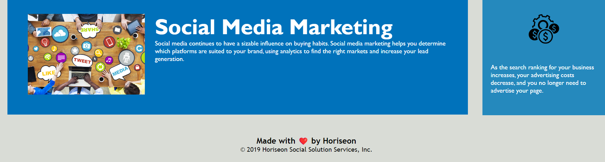

# Horiseon Digital Marketing

## Description

The source code for this project was provided, and I took it upon myself to make significant improvements. I meticulously reworked the HTML code, diligently eliminating duplicated div elements and optimizing the CSS styles. Additionally, I introduced a new section to establish a concise and semantic structure, enhancing both readability and the overall user interface experience.

This README provides an overview of the website's structure and content.

## Table of Contents

- [Features](#features)
- [Screenshots](#screenshots)
- [Installation](#installation)
- [Usage](#usage)
- [Contributing](#contributing)
- [License](#license)

## Features

- Informative content about digital marketing services.
- Clear and accessible navigation with links to detailed service information.
- Descriptive images and alt text for accessibility.
- Benefits of digital marketing services explained.

## screenshots

## Installation

1. **Clone the Repository:**

   Use `git clone` to copy this repository to your local machine:

2. **Open the HTML File:**

Go to the project folder and open `index.html` in your browser.

3. **Explore the Website:**
   Start exploring the website.

## Usage

Visit the live website at Horiseon Digital Marketing to explore the digital marketing services and benefits.

## Contributing

If you'd like to contribute to this project, please follow these steps:

Fork the repository on GitHub.
Clone the forked repository to your local machine.
Create a new branch for your feature or bug fix.
Make your changes and commit them with descriptive commit messages.
Push your changes to your forked repository.
Create a pull request from your forked repository to the original repository.

## License

License: This project is licensed by fiqre

